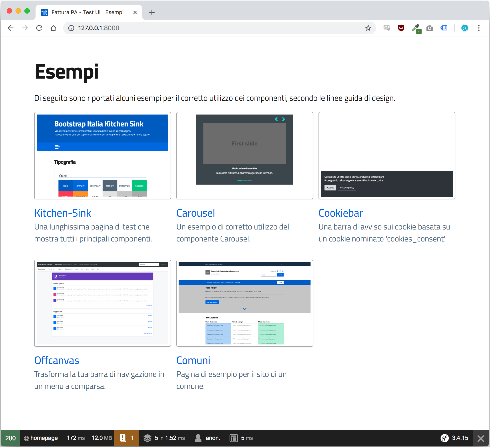

# symfony-italia

Integrazione <a href="https://github.com/italia/bootstrap-italia" target="_blank">Bootstrap Italia</a> in un template Symfony 3.4.	

## Come iniziare

Testato su: amd64 Debian 9.5 (stretch, current stable) con PHP 7.0.

### Installazione

```
sudo apt install composer php-zip php-xml php-cli
composer install
```

### Demo

  1. Avvia il server web built-in di symfony con il comando `php bin/console server:start` nella radice del repo

  2. Visita http://localhost:8000, questo screenshot mostra quello che dovresti vedere:



  3. Arresta il server web built-in di symfony con il comando `php bin/console server:stop`

## Autori

Riccardo Mariani e Paolo Greppi (simevo s.r.l.)

## License

Copyright (c) 2018, The respective authors

License: BSD 3-Clause, see [LICENSE](LICENSE) file.
